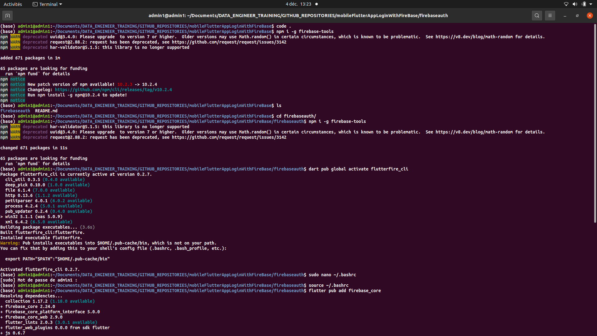

################         FLUTTER MOBILE APP  AUTHENTICATION      ################################

## link to website on which you can view all necessary conf:   https://firebase.google.com/docs/flutter/setup?hl=fr&platform=ios

## Step by step command to successfully add firebase to flutter app:
    -   firebase login
    -   dart pub global activate flutterfire_cli
    -   npm i -g firebase-tools
    -   flutter create <project name>
    -   cd <project name>
    -   flutter pub add firebase_core
    -   flutterfire configure

### ILLUSTRATION

## After that you can config firebase in you main.dart file

